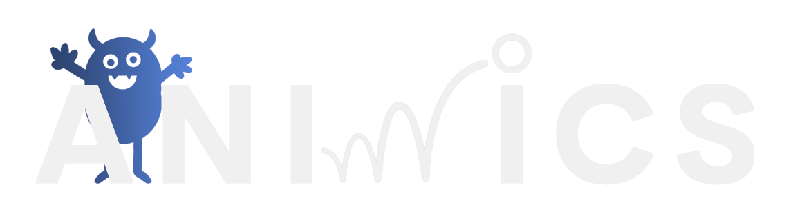
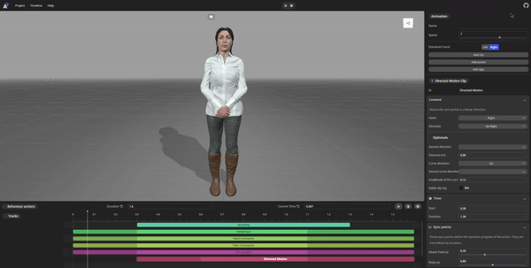
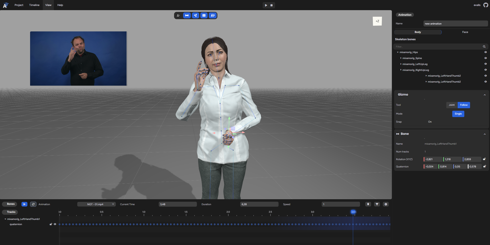
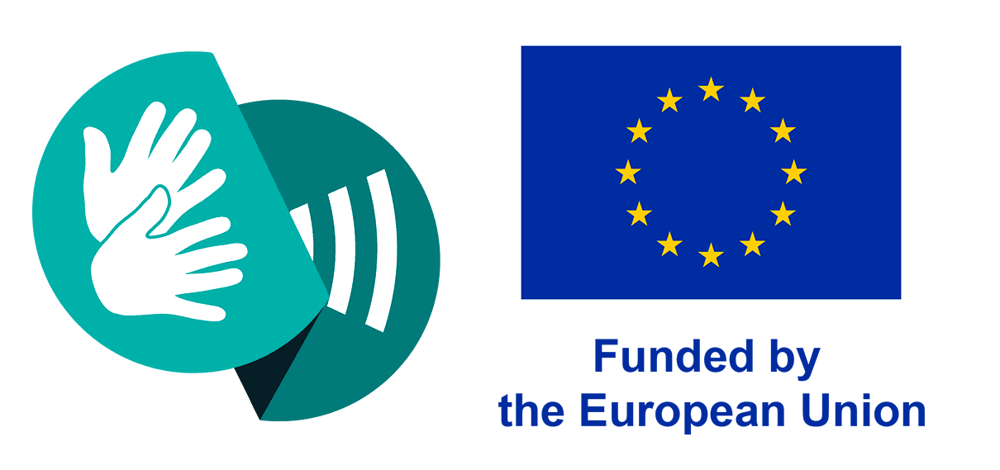

# Animics

[**Animics**](https://animics.gti.upf.edu) is a web-based tool for generating 3D character animations, with a strong focus on sign language and embodied communication. It provides two separate workflows — **Script Mode** and **Keyframe Mode** — for building animations either procedurally or from video data.

> 🚀 This project is part of **Tàndem**, an open suite of tools for expressive, accessible 3D animation.

---

## ✨ Features

### 🎬 Script Mode: Procedural Sign Language Animation based on phonetic representations

Build animations by combining predefined "clips" generated procedurally from and extended **Behavior Markup Language (BML)** and adapted **Signing Gesture Mark-up Language (SiGML)** instructions. These clips cover both **Manual Features (MF)** and **Non-Manual Features (NMF)** — such as hand gestures, facial expressions, mouthing, gaze, and body posture — synthesized in real-time.

- Based on **SiGML** and **BML**.
- Animation sequences are constructed through configurable parameters for each action or instruction.
- Focused on natural, linguistically grounded animation for sign language.

#### 🧠 Public Linguistic Database

- **1,722 glosses** in **NGT** (Sign Language of the Netherlands).
- **6,484 phrases** in **LSF-CH** (Swiss version of the French Sign Language).
- All entries are encoded in **SiGML** and **BML** (as a JSON), and can be used within **Script Mode**.
- Users can create **their own entries** or integrate **public datasets** to expand the database.

> 📌 *Script Mode and Keyframe Mode are separate workflows and cannot be combined.*

---

### 📹 Keyframe Mode: Pose Extraction from Video

Generate animations from human motion captured in video.

- Record yourself with the **webcam** or upload one or multiple video files.
- Pose and facial data is extracted using **MediaPipe**:
  - **Body landmarks**
  - **Facial Action Units**
- Data is mapped internally to:
  - **Skeleton joint rotations**
  - **Morph target weights** for facial expression control.
- Includes **Inverse Kinematics (IK)** for precise adjustments. This feature can be toggled on or off.
- Includes **window-based propagation**, which allows edits made in one frame to automatically influence neighboring frames within a configurable time window. This feature can be toggled on or off.

> 📌 *Keyframe Mode and Script Mode are mutually exclusive per animation.*

---

### 💾 Save, Load & Export

- Users can **register and log in** to save their animations (both modes) to the server and **retrieve them later** for further editing.
- Animations can also be created and exported **without logging in**.
- Supported export formats:

| Mode            | Formats                                 |
|-----------------|------------------------------------------|
| Script Mode     | `BML (JSON)`, `GLB`                      |
| Keyframe Mode   | `BVH`, `BVHE` (extended BVH with facial), `GLB` |
| Keyframe Extras | Raw `MediaPipe` data, original `video`   |

---

### 🚀 **Import & Visualize Animations**

- **Import animation files**: Users can import previously saved animation files in both **Script Mode** and **Keyframe Mode** to continue editing or refine them.
- **Visualize animations in Performs**: Generated animations from both modes can be directly visualized in [Performs](https://github.com/upf-gti/performs), the companion application of the Tàndem suite to play the animations in different avatars, customize the scene and be integrated in other applications.

---

### 🧩 Modular & Friendly UI

- Minimalist, intuitive interface
- Switch easily between Script and Keyframe modes
- Real-time animation preview and editing

---

## 🛠️ Technologies Used

- **Frontend**: 
    - [Lexgui.js](https://github.com/jxarco/lexgui.js/) - A simple and lightweight GUI library for creating graphical user interfaces for web applications.
    - [Three.js](https://github.com/mrdoob/three.js/) - An open-source JavaScript library for creating interactive 3D and 2D graphics in web browsers using WebGL.
    - [litefileserver.js](https://github.com/jagenjo/litefilesystem.js) - A front-end and back-end library that allows javascript apps to store resources.

- **Animation Engine** (custom): 
    - [IK-threejs](https://github.com/upf-gti/IK-threejs) - Custom IK solvers using Three.js.
    - [retargeting-threejs](https://github.com/upf-gti/retargeting-threejs) - Custom retargeting using Three.js.

- **Pose Estimation**: 
    - [Mediapipe](https://github.com/google/mediapipe) - An open-source library from Google for building cross-platform multimodal applied ML pipelines.

## 💬 Community

We have a **Discord server** where you can ask questions, share ideas, and get support related to the project.  
Everyone is welcome!

🔗 **Discord:**: [Join here!](https://discord.gg/9YGrGjnycj)

---

## Developers

- Víctor Ubieto [@victorubieto](https://github.com/victorubieto)
- Jaume Pozo [@japopra](https://github.com/japopra)
- Eva Valls [@evallsg](https://github.com/evallsg)
- Carolina del Corral [@carolinadcf](https://github.com/carolinadcf)
- Alex Rodríguez [@jxarco](https://github.com/jxarco)

## Acknowledgements
We would like to extend our gratitude to the creators and maintainers of these libraries for their invaluable contributions to the open-source community.

## Support

This project is being developed with partial financial support of:

| EMERALD Project (2023-2026) | SignON Project (2021-2023) |
| --- | --- |
|  |  |
